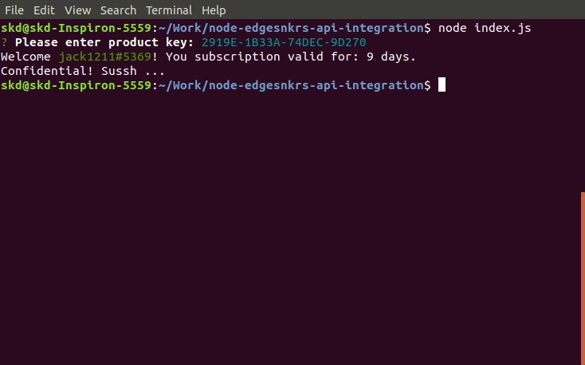

# [Edgesnkrs](https://www.edgesnkrs.com/api/v1/activations) License Key Activator

> A Node.js library to handle License Key authentication of an application with [Shrey Auth](https://docs.shreyauth.com/)



# Install

You require `node` and `npm` installed. To clone the repository and install the NPM modules, run:

```bash
# clone repository
git clone https://github.com/skdcodes/freelancer-app-Node.js_Authentication_API-Edgesnkrs_License_Key_Activator.git edgesnkrs

# change directory
cd edgesnkrs

# install npm modules
npm install
```

# Usage

The main verification module is `license.js`. You can use it in your application as shown in the sample `index.js`.

```js
const license = require("./license");

async function start() {
  // The validation flow is the following:
  // 1. Check if a token exists, if not asks for "License key".
  // 2. Validates the activation_token to receive user information.

  // Halts program is halted till a valid user is retrieved.

  await license.validate();

  // This is only accessible after successful validation
  console.log("Confidential! Sussh ...");
}

start();
```

# Future

- What response is received if a valid token is sent after the renewal period?
- Can the same token be used after renewal?
